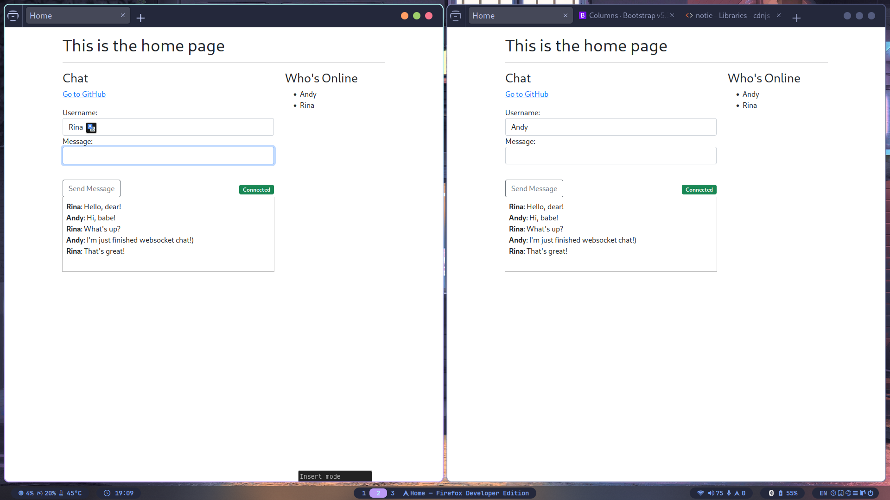

# WebSocket Browser Chat on Golang



## Start project

```sh
git clone https://github.com/RAprogramm/wsChat.git
cd wsChat
make
```

### In this project used:

1. [Bootstrap](https://getbootstrap.com/) Powerful, extensible, and feature-packed frontend toolkit. Build and customize with Sass, utilize prebuilt grid system and components, and bring projects to life with powerful JavaScript plugins.
2. [websocket](https://github.com/gorilla/websocket) is a Go implementation of the WebSocket protocol.
3. [pat](https://github.com/bmizerany/pat) is a Sinatra style pattern muxer for Go's net/http library.
4. [jet](https://github.com/CloudyKit/jet) is a template engine developed to be easy to use, powerful, dynamic, yet secure and very fast.
